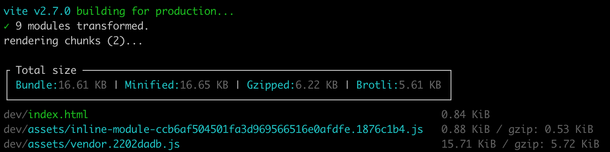

# rollup-plugin-total-bundlesize

> A rollup plugin that showing the total size of the bundle, it complements Vite's summary

<br>



<hr>
<br>

## Installation

```
npm install @blockquote/rollup-plugin-total-bundlesize
```

## Usage

```js
import totalBundlesize from '@blockquote/rollup-plugin-total-bundlesize'

export default {
    entry: 'index.js',
    plugins: [
        totalBundlesize()
    ]
}
```
<br>

## options

### totalBundlesize( options?)

> Type: [`object boxen options?`](https://github.com/sindresorhus/boxen#options)

```js
import totalBundlesize from 'rollup-plugin-total-bundlesize'

export default {
    entry: 'index.js',
    plugins: [
        totalBundlesize({title: 'magical', titleAlignment: 'center'})
    ]
}
````

## License

MIT
